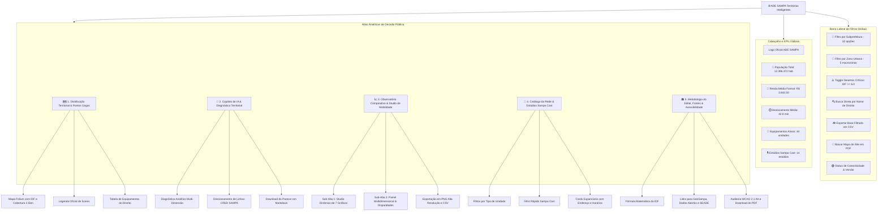

# 🗺️ Mapa do Site & Guia de Navegação do Usuário
### ADE SAMPA Territórios Inteligentes — Edital de Seleção Pública nº 005/2026

Este documento apresenta a arquitetura da informação, o fluxo de navegação e o guia de funcionalidades do sistema **ADE SAMPA Territórios Inteligentes**. 

> 📄 **Documento Oficial em PDF Ilustrado:** Para visualização diagramada com capturas de tela fidedignas em alta definição, baixe o arquivo oficial **[docs/mapa_do_site_adesampa.pdf](docs/mapa_do_site_adesampa.pdf)** (também disponível diretamente pelo botão na barra lateral ou na Aba 5 da aplicação web).

---

## 🧭 1. Diagrama Geral de Navegação

A aplicação é organizada em **5 abas analíticas temáticas**, alimentadas por uma **Barra Lateral de Filtros Globais** com sincronização instantânea em memória e modo offline autônomo:

---

## 👥 2. Personas e Jornadas de Uso

| Persona | Objetivo Principal | Rota Recomendada |
| :--- | :--- | :--- |
| **Banca Avaliadora (Edital 005/2026)** | Verificar requisitos do edital, robustez do código, dados reais e arquitetura de IA autônoma. | Roteiro de 5 minutos: Sidebar → Aba 1 (Mapa) → Aba 2 (IA) → Aba 3 (Studio) → Aba 5 (Metodologia e PDF). |
| **Gestor Público (ADE SAMPA / SMDET)** | Alocar novas unidades da Rede Teia e turmas da Fábrica de Negócios em desertos de fomento. | Ativar "Apenas Desertos Críticos" na Barra Lateral → Analisar distritos vermelhos na Aba 1 → Gerar parecer na Aba 2. |
| **Cidadão / Empreendedor Paulistano** | Localizar serviços gratuitos de coworking, fabricação digital ou estúdio de podcast. | Acessar Aba 4 (Catálogo) → Filtrar por bairro ou ativar "Apenas Sampa Cast" → Consultar horários e serviços. |

---

## ⚡ 3. Roteiro de Avaliação Rápida (5 Minutos para a Banca)

Para que os membros da banca examinadora possam testar integralmente o sistema de forma dinâmica e ágil:

1. **Minuto 1 — Filtros e Mapa Interativo (Aba 1):**
   - Na barra lateral esquerda, selecione a Zona **Leste** ou a Subprefeitura **Itaquera**.
   - Observe o mapa central re-enquadrar dinamicamente (`fit_bounds`) e os distritos não selecionados ficarem suavizados.
   - Clique em um marcador no mapa para ver o pop-up com serviços e raio de cobertura de 2.5 km.
   - Baixe a base filtrada clicando no botão **📥 Baixar Base Filtrada (CSV)** na barra lateral.

2. **Minuto 2 — Inteligência Artificial Autônoma (Aba 2):**
   - Mude para a **Aba 2 (Copiloto de IA)**.
   - Selecione um distrito vulnerável (ex.: *Cidade Tiradentes* ou *Grajaú*).
   - Clique em **🤖 Gerar Diagnóstico Territorial com IA**.
   - Analise o parecer técnico gerado instantaneamente com justificativas socioeconômicas, cálculo de IDF e recomendações de microcrédito.
   - Clique no botão **📥 Exportar Parecer Técnico (.md)** para baixar o relatório.

3. **Minuto 3 — Studio Dinâmico de Gráficos e Exportação (Aba 3):**
   - Abra a **Aba 3 (Observatório Comparativo)**.
   - No **Studio Dinâmico de Mobilidade**, experimente alternar entre os tipos visuais: **Barras Horizontais**, **Pirulito (Lollipop)** e **Pizza (Donut)**.
   - Note a inteligência da interface: ao escolher gráfico de Pizza ou Dispersão, os botões de ordenação são suavemente desabilitados com aviso didático.
   - Clique no botão **🖼️ Baixar Gráfico em Alta Resolução (PNG)** para validar a exportação gráfica a 300 DPI via Kaleido.

4. **Minuto 4 — Catálogo e Estúdios de Podcast (Aba 4):**
   - Abra a **Aba 4 (Catálogo da Rede)**.
   - Marque a caixa de seleção **Apenas unidades com Estúdio Sampa Cast 🎙️**.
   - Veja a lista enxuta com as 14 unidades equipadas para gravação de podcast e capacitação em economia criativa.

5. **Minuto 5 — Metodologia, Auditoria e Download do PDF (Aba 5):**
   - Acesse a **Aba 5 (Metodologia & Sobre o Edital)**.
   - Confira a formulação matemática do Índice de Deserto de Fomento (IDF), as fontes municipais e as regras de acessibilidade WCAG 2.1 AA.
   - Clique no botão **📄 Baixar Guia Visual & Mapa do Site (PDF Ilustrado)** para testar o download do documento compilado.

---

## 🏢 4. Catálogo Iconográfico Oficial

Para garantir máxima clareza e acessibilidade aos usuários, a aplicação utiliza uma identidade visual uniforme:

| Ícone / Marcador | Equipamento / Elemento | Finalidade e Descrição | Cor no Mapa |
| :---: | :--- | :--- | :---: |
| 💻 | **Rede Teia** | Espaço público e gratuito de coworking, internet de alta velocidade e reuniões para empreendedores. | Azul Real (`#2563EB`) |
| 🧊 | **FabLab Livre SP** | Laboratório de prototipagem rápida e fabricação digital com impressoras 3D e corte a laser. | Ciano Tecnológico (`#0891B2`) |
| 💼 | **Posto ADE SAMPA** | Posto integrado com atendimento presencial, formalização MEI e orientação de crédito. | Roxo Profundo (`#7C3AED`) |
| ⭕ | **Raio de Cobertura (2.5 km)** | Buffer territorial estimado de influência direta para deslocamentos a pé ou transporte público local. | Azul translúcido |
| 🎙️ | **Estúdio Sampa Cast** | Estúdio de áudio e vídeo instalado dentro de Teias/FabLabs para podcast e economia criativa. | Crachá Âmbar (`#D97706`) |

---

## 📊 5. Catálogo dos 7 Gráficos do Studio de Mobilidade

Na Sub-Aba 1 da Aba 3, o usuário conta com 7 opções gráficas interativas e totalmente exportáveis:

1. **Barras Horizontais (Padrão de Ranking):** Excelente para listar e comparar os distritos por tempo de trânsito em ordem decrescente, com rótulos de valores destacados.
2. **Barras Verticais (Colunas):** Comparação clássica em colunas verticais com paleta gradiente contínua.
3. **Pirulito (Lollipop Chart):** Design limpo e moderno que reduz a poluição visual quando muitos distritos são selecionados simultaneamente.
4. **Gráfico de Linha com Marcadores:** Demonstra a curva de distribuição do tempo de deslocamento ao longo dos distritos.
5. **Gráfico de Área Preenchida:** Apresenta a magnitude do acúmulo de tempo de deslocamento com preenchimento semitransparente.
6. **Pizza / Donut de Composição:** Agrupa os distritos em faixas operacionais (<=30 min, 31-45 min, 46-60 min e >60 min). *(Ordenação desabilitada automaticamente com aviso).*
7. **Dispersão Cartesiana (Tempo x Renda):** Cruza o tempo de deslocamento com a renda média formal do distrito para revelar o isolamento periférico. *(Ordenação desabilitada automaticamente com aviso).*

---

## 📥 6. Recursos de Exportação Disponíveis no Sistema

| Recurso | Formato | Onde Encontrar | Compatibilidade |
| :--- | :---: | :--- | :--- |
| **Base Filtrada de Distritos** | CSV | Barra Lateral (botão `📥 Baixar Base Filtrada`) | Excel PT-BR (`UTF-8 com BOM`, separador `;`) |
| **Parecer Técnico do Copiloto** | Markdown | Aba 2 (botão `📥 Exportar Parecer Técnico`) | Editores de texto, Obsidian, Notion e Word |
| **Gráficos em Alta Resolução** | PNG | Aba 3 (botão `🖼️ Baixar Gráfico em PNG`) | 300 DPI, fundo branco e layout nítido via Kaleido |
| **Dados do Gráfico do Studio** | CSV | Aba 3 (botão `📥 Baixar Dados do Gráfico`) | Planilhas eletrônicas e pipelines analíticos |
| **Tabela Resumo por Subprefeitura** | CSV | Aba 3 (Sub-Aba 2, botão `📥 Baixar Tabela`) | Indicadores consolidados por Subprefeitura |
| **Guia Completo & Mapa do Site** | PDF | Barra Lateral e Aba 5 | Documento diagramado A4 de 5 páginas com capturas reais |

---

*ADE SAMPA — Agência São Paulo de Desenvolvimento • Secretaria Municipal de Desenvolvimento Econômico e Trabalho • Prefeitura de São Paulo*
